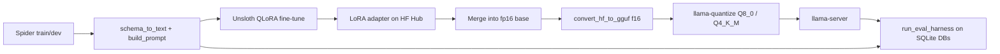
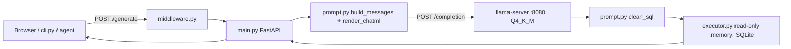

# 🧠 Fine-Tuned Text-to-SQL Engine — QLoRA on Spider, quantized to GGUF and served over an API

Fine-tuning a small open-weight model (Qwen2.5-Coder-3B) on Spider to beat its own zero-shot baseline on text-to-SQL, measured by a SQL-execution eval harness, then merged, quantized to GGUF and served through a FastAPI layer with a demo UI, a CLI and a Docker image.

Full project plan: `docs/PRD.md` and `docs/phase-0-tasks.md` through `docs/phase-4-tasks.md`.

## 🚀 Features

- 🎯 **Execution-based evaluation** — generated SQL is run against the real Spider SQLite databases (read-only) and result sets are compared, with exact match as a secondary metric.
- 🔁 **Model-agnostic harness** — `run_eval_harness` takes any `(question, schema_text) -> sql` function, so the same code scored the base model, LoRA checkpoints and GGUF servers.
- 🧪 **QLoRA fine-tuning with Unsloth** — tracked in Weights & Biases, with resumable checkpoints across Colab disconnects.
- 🔍 **Failure-pattern review** — four named hard patterns (hallucinated joins, self-joins, set operations, NOT IN) rechecked at every phase, because aggregate accuracy alone hid what changed.
- 📦 **Merge and quantize** — LoRA merged into fp16 weights, converted to GGUF, quantized to Q8_0 and Q4_K_M, and re-evaluated.
- 🌐 **Inference API** — `POST /generate` takes a schema and a question, renders the exact training prompt, calls `llama-server`, cleans the output to one SQL statement and returns it with the query result.
- 🛡️ **Guarded SQL execution** — generated SQL runs against a throwaway in-memory SQLite database built from the request's schema, with read-only enforcement, a 3 s timeout and a 50-row cap.
- 🚦 **Request controls** — per-IP rate limit, an in-flight generation cap, a server-generated `X-Request-Id` on every response and one access-log line per request.
- 🖥️ **Demo UI and CLI** — a single static page served at `/` with built-in example schemas, and `cli.py` for the terminal.
- 🐳 **One-container deployment** — a Docker image that runs `llama-server` and the API together and pulls or mounts the GGUF at start.

## 📊 Results so far

| Stage | Exec. accuracy | Exact match | Notes |
|---|---|---|---|
| Phase 0 — zero-shot baseline | 61.0% | 10.5% | 200-example Spider dev subset, seed 42 |
| Phase 1 — first fine-tune | 75.5% | 38.0% | r=16/a=32, 1,455 examples, 1 epoch |
| Phase 2 — selected variant (a) | 72.5% | 43.5% | 9,380 augmented examples, 2 epochs |
| Phase 3 — f16 GGUF | 74.5% | 45.5% | 6.18 GB, 32.5 tok/s |
| Phase 3 — Q8_0 | 73.5% | 45.5% | 3.29 GB, 53.4 tok/s |
| Phase 3 — **Q4_K_M (shipping)** | 75.5% | 45.0% | 1.93 GB, 64.3 tok/s |

The test set is 200 examples, so the 95% margin of error is about ±6 points. Differences of a few points between rows, including Phase 1 vs Phase 2 and the three Phase 3 variants, are within noise. Exact match and the failure-pattern reviews are the more informative signals. See each phase summary for detail.

### Serving (Phase 4)

Measured on a Windows laptop (Intel Core i5-11400H, 6 cores / 12 threads, 23.7 GB RAM), CPU only, Q4_K_M, greedy decoding, 25 Spider dev examples sent sequentially.

| Setup | End-to-end p50 | End-to-end p95 | Generation-only p50 / p95 |
|---|---|---|---|
| Native `llama-server`, default threads | 3,126 ms | 9,548 ms | 2,942 / 9,362 ms |
| Container, `--cpus 2 --memory 4g`, 2 threads | 4,950 ms | 12,240 ms | 4,786 / 12,068 ms |

- **Cold start:** 54 s for the container to become ready, about 52 s of it loading the model from a bind mount.
- **Image size:** 1.3 GB on disk (333 MB compressed).
- **Memory:** the native `llama-server` working set was 2.09 GB at `-c 2048`.
- **Faithfulness to Phase 3:** the hand-rendered ChatML prompt is byte-identical to `tokenizer.apply_chat_template` on 20 test examples. On 25 dev examples the served SQL is identical to the Phase 3 Q4_K_M output on 23/25 (native) and 24/25 (container), with the same result rows on 22/23 and 23/23 of the queries that ran. The differing examples change between llama.cpp builds, which points to borderline-token flips and not a serving error.
- p95 is taken over 25 requests, and latency grows with schema length because CPU prompt processing dominates long prompts.

More detail is in `notes/serving.md`.

## 🏗️ How it works



1. Each Spider example becomes a chat-template prompt: system message, schema as `CREATE TABLE` text plus FK comments, and the question.
2. The model generates SQL, `extract_sql` strips fences and explanation, and the harness executes both generated and gold SQL on the example's database.
3. Rows are compared as sets of tuples (order-insensitive across rows, positional across columns).

### Serving path



1. `RequestMiddleware` assigns an `X-Request-Id`, applies the per-IP rate limit and the in-flight cap to `POST /generate`, and logs the request.
2. `main.py` validates the request, renders the training prompt as ChatML with `app/prompt.py` (no `transformers` at runtime) and posts it to `llama-server`'s `/completion` with `temperature=0` and `<|im_end|>` as the stop token.
3. `clean_sql` reduces the completion to one statement.
4. `executor.run_sql` builds a fresh `:memory:` database from `schema` plus the optional `data_sql`, then runs the statement under a read-only authorizer with a timeout and a row cap.
5. The response returns the SQL, the generation latency and the execution result.

Only `schema` goes into the model prompt. `data_sql` (INSERT statements) is used only by the executor, so the prompt stays in the format the model was trained on.

### API

| Endpoint | Purpose |
|---|---|
| `POST /generate` | Generate SQL for a schema and question, and optionally execute it |
| `GET /health` | 200 when the API and `llama-server` are ready, 503 otherwise |
| `GET /examples` | Built-in demo schemas, sample data and questions (`app/examples.py`) |
| `GET /` | The demo UI (`app/static/index.html`) |
| `GET /docs` | FastAPI's generated OpenAPI page |

`POST /generate` request body:

| Field | Required | Limit | Notes |
|---|---|---|---|
| `schema` | yes | 1 to 6,000 chars | `CREATE TABLE` statements in the training format (`name type PRIMARY KEY`, `-- FK:` comment lines) |
| `question` | yes | 1 to 500 chars | |
| `data_sql` | no | up to 20,000 chars | INSERT statements for the executor only |
| `execute` | no | default `true` | `false` returns SQL only |

Response fields: `sql`, `latency_ms` (generation only, execution time excluded) and `execution_result` (`columns`, `rows`, `truncated`, `error`, or `null` when `execute` is `false`).

Status codes: `422` invalid request, `429` rate limited (with `Retry-After`), `502` `llama-server` unreachable, bad response or empty SQL, `503` too many generations in flight, `504` `llama-server` timed out.

```bash
curl -X POST http://127.0.0.1:7860/generate -H "Content-Type: application/json" \
  -d '{"schema":"CREATE TABLE singer (singer_id number PRIMARY KEY, name text, age number);","question":"How many singers are older than 30?"}'
```

## 📦 Repo layout

```
Text-to-SQL/
├── README.md
├── requirements.txt                 # training / notebook / eval dependencies
├── requirements-api.txt             # runtime dependencies for the API and the container
├── dockerfile                       # llama.cpp server image + Python venv + app
├── start.sh                         # fetch model if missing, start llama-server, wait for /health, start uvicorn
├── cli.py                           # command-line client for the API
├── .gitignore                       # excludes data/, adapters, checkpoints, *.gguf
├── .dockerignore                    # keeps data, models and notebooks out of the build context
├── app/
│   ├── main.py                      # FastAPI app: /generate, /health, /examples, /
│   ├── prompt.py                    # build_messages, render_chatml, clean_sql (training-format prompt)
│   ├── executor.py                  # run_sql: throwaway read-only SQLite, timeout, row cap
│   ├── middleware.py                # rate limit, in-flight cap, request IDs, access log
│   ├── examples.py                  # built-in demo schemas, sample data and questions
│   └── static/
│       └── index.html               # demo UI
├── docs/
│   ├── PRD.md
│   ├── phase-0-tasks.md
│   ├── phase-1-tasks.md
│   ├── phase-2-tasks.md
│   ├── phase-3-tasks.md
│   └── phase-4-tasks.md
├── configs/
│   └── phase2_variants.py           # Phase 2's 3 hyperparameter variants + results
├── notebooks/
│   ├── phase0_setup.ipynb           # pipeline, harness, zero-shot baseline
│   ├── phase1_finetuning.ipynb      # first QLoRA fine-tune and comparison
│   ├── phase2_iteration.ipynb       # full-dataset sweep, curation, checkpoint selection
│   └── phase3_quantization.ipynb    # merge, GGUF, quantize, eval, benchmark
├── notes/
│   └── serving.md                   # Phase 4 serving notes and measurements
├── scripts/
│   ├── check_template.py            # hand-rendered ChatML vs tokenizer.apply_chat_template
│   ├── compare_outputs.py           # llama-server output vs Phase 3 Q4_K_M, first 20 examples
│   ├── smoke_test.py                # 25 examples through the API: agreement, accuracy, p50/p95
│   ├── test_api.py                  # API request script
│   └── dumps.py                     # scratch check of gold vs generated SQL for one example
├── tests/
│   ├── test_executor.py             # 5 executor cases
│   └── test_middleware.py           # 4 middleware cases
├── data/                            # NOT committed — see data/README.md
│   └── README.md
├── spider_data/                     # NOT committed — Spider .sqlite databases used by the eval scripts
├── models/
│   ├── model_card.md                # Phase 2 adapter: HF Hub link, config, rationale
│   └── text2sql-Q4_K_M.gguf         # NOT committed — mounted into the container or served directly
└── results/
    ├── phase0_summary.md
    ├── phase1_summary.md
    ├── phase2_summary.md
    ├── phase3_summary.md
    ├── experiment-log.md
    ├── finetune_results/
    │   ├── baseline_zero_shot_results.json
    │   ├── finetuned_v1_eval_results.json
    │   ├── phase2_{a,b,c}_epoch1_eval_results.json
    │   ├── phase2_{a,b,c}_final_eval_results.json
    │   └── phase2_a_final_recovered_eval_results.json
    └── quantization_results/
        ├── phase3_f16_eval_results.json
        ├── phase3_Q8_0_eval_results.json
        ├── phase3_Q4_K_M_eval_results.json
        ├── phase3_bench_results.json
        ├── phase3_quant_eval_summary.json
        ├── phase3_quantization_tradeoff.csv
        └── phase3_quantization_tradeoff.md
```

Adapter weights, checkpoints and GGUF files are not committed. The Phase 2 adapter is on Hugging Face Hub (`JaveedHabeeb/text-to-sql-qwen2.5-coder-3b-phase2`). GGUF files are regenerated by `notebooks/phase3_quantization.ipynb`.

Training and evaluation code lives in each phase's notebook. Each notebook redefines the prior phase's core functions at the top, since fresh Colab runtimes carry no state. Key functions:

- `schema_to_text(db_id, schema_lookup)` / `build_prompt(schema_text, question, gold_sql=None)`
- `get_db_connection(db_id)` / `run_sql(conn, sql_string)`
- `execution_match(conn, generated_sql, gold_sql)` / `exact_match(generated_sql, gold_sql)`
- `run_eval_harness(test_examples, generate_fn, results_path)`
- `generate_sql(question, schema_text, model, tokenizer)` — in-process inference
- `llama_server_generate_sql(question, schema_text, port)` — same contract, via `llama-server` (Phase 3)
- `check_failure_patterns(model, tokenizer, label)` — reruns the four named hard examples
- `log_experiment_row(config, exec_acc, exact_match, notes)` — appends to the experiment log and a W&B Table

The serving code in `app/` is a separate Python package. Its `executor.run_sql(schema_ddl, sql, max_rows=50, timeout_s=3.0)` builds its own database from DDL and is not the notebooks' `run_sql(conn, sql_string)`.

## ⚙️ Setup

### Training and evaluation (Phases 0 to 3)

The notebooks target Google Colab with a T4 GPU.

```bash
pip install -r requirements.txt
git lfs install
git lfs clone https://huggingface.co/datasets/minktn/spider-data
```

Question/SQL/schema data loads via `datasets` (`xlangai/spider`). The per-database `.sqlite` files come from the `minktn/spider-data` mirror because the official dataset repo only ships parquet. The eval scripts under `scripts/` expect those databases at `spider_data/database`, and the saved test split at `data/test.jsonl`.

For Phase 3, clone and build llama.cpp inside the notebook:

```bash
git clone https://github.com/ggerganov/llama.cpp
cmake -B llama.cpp/build -S llama.cpp -DGGML_CUDA=ON
cmake --build llama.cpp/build --config Release -j2 --target llama-quantize
cmake --build llama.cpp/build --config Release -j2 --target llama-server
cmake --build llama.cpp/build --config Release -j2 --target llama-bench
```

Build targets one at a time with limited jobs. An unlimited `-j` CUDA build runs out of Colab RAM.

### Serving (Phase 4)

Prerequisites: the quantized GGUF at `models/text2sql-Q4_K_M.gguf` and a llama.cpp `llama-server` binary (a prebuilt release is enough for CPU). Docker is only needed for the container path.

```bash
python -m venv .venv
.venv\Scripts\activate            # Windows; on Linux/macOS: source .venv/bin/activate
pip install -r requirements-api.txt
```

## ▶️ Running

### Notebooks

Open the notebook for the phase you want in Colab and run top to bottom:

- `phase0_setup.ipynb` — environment, preprocessing, harness, zero-shot baseline
- `phase1_finetuning.ipynb` — LoRA config, training, formal eval, comparison
- `phase2_iteration.ipynb` — curation, 3-variant sweep, error analysis, Hub push
- `phase3_quantization.ipynb` — merge, GGUF conversion, quantization, per-variant eval, benchmark

In Phase 3, run the merge before `pip install -r llama.cpp/requirements.txt`, which downgrades `transformers`. Restart the runtime after that install. Serve a model on any port except 8080 inside Colab (Colab uses it), for example `llama-server -m text2sql-Q4_K_M.gguf --port 8091 -c 2048`.

### API, locally

Start the model server, then the API (ports: `llama-server` 8080, API 8000):

```bash
llama-server -m models/text2sql-Q4_K_M.gguf -c 2048 --port 8080
uvicorn app.main:app --port 8000
```

Open `http://127.0.0.1:8000/` for the UI or `http://127.0.0.1:8000/docs` for the API page. On Windows use `127.0.0.1` and not `localhost`: in testing, `localhost` added about 2 s per request.

CLI:

```bash
python cli.py --example 0 --url http://127.0.0.1:8000
python cli.py --schema schema.sql --data data.sql --question "How many singers are there?" --url http://127.0.0.1:8000
```

### API, in Docker

```bash
docker build -t text2sql .
docker run --rm -p 7860:7860 --cpus 2 --memory 4g -v "${PWD}/models:/models" text2sql
```

The container runs `llama-server` on `127.0.0.1:8080` inside, and the API on port 7860 (or `PORT`). `--cpus 2 --memory 4g` approximates a small free host. If the GGUF is not mounted, set `MODEL_REPO` (and optionally `MODEL_FILE`) to download it from the Hugging Face Hub at start.

## 🔧 Environment variables

| Variable | Required | Default | Purpose |
|---|---|---|---|
| `WANDB_API_KEY` | Phase 1+ notebooks | none | Colab secret read via `google.colab.userdata.get`; authenticates W&B logging |
| `LLM_BASE_URL` | no | `http://127.0.0.1:8080` | Where the API finds `llama-server` (`app/main.py`; set to the same value in the Dockerfile) |
| `LLM_TIMEOUT_S` | no | `120` | Read timeout for a generation call |
| `RATE_LIMIT_PER_MIN` | no | `10` | Max `POST /generate` requests per client IP per minute |
| `MAX_INFLIGHT` | no | `4` | Max concurrent generations before the API answers 503 |
| `TRUST_PROXY_HEADERS` | no | `1` | Use `CF-Connecting-IP` / `X-Forwarded-For` as the client IP; set to `0` if the API is exposed directly |
| `MODEL_PATH` | no | `/models/text2sql-Q4_K_M.gguf` | GGUF location inside the container (`start.sh`) |
| `MODEL_REPO` | only if `MODEL_PATH` is missing | none | Hugging Face repo to download the GGUF from at start |
| `MODEL_FILE` | no | basename of `MODEL_PATH` | File name inside `MODEL_REPO` |
| `LLAMA_THREADS` | no | `2` | `-t` value passed to `llama-server` |
| `PORT` | no | `7860` | Port `uvicorn` listens on in the container |

Pushing to Hugging Face Hub (Phase 2) needs an account with write access.

## 🧪 Testing

```bash
python -m pytest tests -v
```

Nine tests: the executor (valid query, syntax error, `DROP TABLE` and a stacked statement rejected, runaway recursive CTE hitting the timeout, row truncation) and the middleware (request ID header, 429 with `Retry-After`, per-IP limits, unlimited non-generate paths).

Serving checks, run from the repo root with the servers up:

- `python scripts/check_template.py` — compares the hand-rendered ChatML with `tokenizer.apply_chat_template` on the first 20 test examples and prints the mismatch count (needs `transformers` and `data/test.jsonl`).
- `python scripts/compare_outputs.py` — sends 20 test prompts to `llama-server` on 8080 and compares the output with `results/quantization_results/phase3_Q4_K_M_eval_results.json`.
- `python scripts/smoke_test.py --spider-db-root spider_data/database --url http://127.0.0.1:8000` — sends 25 dev examples through `/generate`, then reports agreement with Phase 3, execution accuracy against gold and p50/p95 latency. It fails immediately if `/health` is not 200. Against a container, start it with `-e RATE_LIMIT_PER_MIN=1000`, otherwise the default limit returns 429s.

Eval-harness correctness is checked by the harness itself:

- **Perfect and broken generators.** A generator returning gold SQL should score ~100%, and one returning `SELECT 1;` should score ~0% (Phase 0).
- **Same 200-example subset in every phase.** `random.seed(42); random.sample(test_formatted, 200)`.
- **Merge check.** The saved merged model must contain no tensor names with `lora` or `base_layer`, and no `adapter_config.json`.
- **Server smoke test.** Each `llama-server` variant answers a trivial question before the 200-example run. A run that finishes in seconds means the server was not answering.

## 🛠️ Tech stack

- **Training:** Unsloth, PEFT, bitsandbytes, TRL, Transformers, Datasets, Accelerate
- **Tracking:** Weights & Biases
- **Evaluation:** Python `sqlite3`, pandas, tqdm
- **Quantization and inference:** llama.cpp (`convert_hf_to_gguf.py`, `llama-quantize`, `llama-server`, `llama-bench`), gguf, requests
- **API:** FastAPI, Uvicorn, httpx, Pydantic, huggingface_hub
- **Frontend:** a single static HTML page with plain JavaScript (no framework)
- **Testing:** pytest
- **Packaging and demo hosting:** Docker (base image `ghcr.io/ggml-org/llama.cpp:server`), Cloudflare quick tunnel (`cloudflared`)
- **Model hosting:** Hugging Face Hub (adapter)

## ⚠️ Known limitations

- **Small test set.** 200 examples give a ±6 point margin, so small differences between checkpoints or quantization levels cannot be resolved. The 25-example serving checks are coarser still (one example is 4 points), which is why they measure agreement with Phase 3 and not accuracy.
- **Set operations are unresolved.** `UNION`/`INTERSECT` queries get the right shell but the wrong second branch, in every Phase 2 variant.
- **Open pattern.** `model_list`/`car_names` table confusion on car/model questions.
- **Phase 2 did not beat Phase 1 on aggregate execution accuracy** (72.5% vs 75.5%, within noise); it improved exact match and fixed more of the named hard patterns, which is why it was selected.
- **Execution accuracy can pass a wrong query.** One served query filtered on a city value that does not appear in the question and still matched the gold result, most likely because both returned an empty or zero result. Some of the reported accuracy may be coincidental passes of this kind.
- **Phase 3 speed figures are from Colab.** The hardware type behind the 32.5 / 53.4 / 64.3 tok/s figures was not confirmed, and peak memory was not captured there. The Phase 4 latencies above are from a local CPU and are not comparable.
- **Serving latency is CPU-bound.** Local p95 is about 9.5 s native and about 12 s with 2 CPUs, and it grows with schema length. A free 2-vCPU host with slower cores will be slower. The container takes about a minute to become ready.
- **Prompt format matters.** The model was trained on `CREATE TABLE name (col type PRIMARY KEY, ...);` plus `-- FK:` lines. DDL in other styles (`REFERENCES`, `NOT NULL`, `AUTOINCREMENT`) is off-distribution and may lower accuracy. Sample rows go in `data_sql` for that reason.
- **The executor is not production hardening.** It blocks writes, `ATTACH` and `PRAGMA`, times out at 3 s and caps rows, but it does not bound memory use and has not been security-audited. Intended for disposable databases only.
- **Rate limit state is in-memory and per process.** Restarting the server resets it, and several workers or instances would each enforce their own limit.
- **Concurrency.** Requests queue inside `llama-server`, so a burst slows every request. The API sheds load above `MAX_INFLIGHT` with a 503.
- **Text-to-SQL scope.** SQLite/Postgres-style syntax, single-turn questions, disposable databases only.

## 🌐 Live demo

There is no permanent public URL. The demo runs from the local Docker container exposed with a Cloudflare quick tunnel:

```bash
docker run --rm -p 7860:7860 --cpus 2 --memory 4g -v "${PWD}/models:/models" text2sql
cloudflared tunnel --url http://localhost:7860
```

`cloudflared` prints a temporary `https://<random-words>.trycloudflare.com` address that serves the UI and the API. The address changes every time the tunnel restarts, and it only works while the machine and the container are running. The model also runs on CPU, so the first request after a start can take a while. If the demo looks unresponsive, the machine is most likely off or the tunnel has been restarted.

Hosting a Docker Space on Hugging Face requires a paid plan at the time of writing, and no free host with enough memory for the 1.9 GB model has been deployed to.

## 🗺️ Roadmap

- [x] Phase 0 — Setup & Baseline
- [x] Phase 1 — First Fine-Tune
- [x] Phase 2 — Iterate on Data & Hyperparameters
- [x] Phase 3 — Merge, Quantize, Benchmark
- [x] Phase 4 — Serve It
- [ ] Phase 5 — Polish & Integrate (demo recording, Track A backend integration)