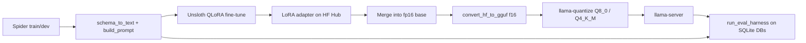

# 🧠 Fine-Tuned Text-to-SQL Engine — QLoRA on Spider, quantized to GGUF

Fine-tuning a small open-weight model (Qwen2.5-Coder-3B) on Spider to beat its own zero-shot baseline on text-to-SQL, measured by a SQL-execution eval harness, then merged and quantized for self-hosted serving.

Full project plan: `docs/PRD.md` and `docs/phase-0-tasks.md` through `docs/phase-3-tasks.md`.

## 🚀 Features

- 🎯 **Execution-based evaluation** — generated SQL is run against the real Spider SQLite databases (read-only) and result sets are compared, with exact match as a secondary metric.
- 🔁 **Model-agnostic harness** — `run_eval_harness` takes any `(question, schema_text) -> sql` function, so the same code scored the base model, LoRA checkpoints and GGUF servers.
- 🧪 **QLoRA fine-tuning with Unsloth** — tracked in Weights & Biases, with resumable checkpoints across Colab disconnects.
- 🔍 **Failure-pattern review** — four named hard patterns (hallucinated joins, self-joins, set operations, NOT IN) rechecked at every phase, because aggregate accuracy alone hid what changed.
- 📦 **Merge and quantize** — LoRA merged into fp16 weights, converted to GGUF, quantized to Q8_0 and Q4_K_M, and re-evaluated.

## 📊 Results so far

| Stage | Exec. accuracy | Exact match | Notes |
|---|---|---|---|
| Phase 0 — zero-shot baseline | 61.0% | 10.5% | 200-example Spider dev subset, seed 42 |
| Phase 1 — first fine-tune | 75.5% | 38.0% | r=16/a=32, 1,455 examples, 1 epoch |
| Phase 2 — selected variant (a) | 72.5% | 43.5% | 9,380 augmented examples, 2 epochs |
| Phase 3 — f16 GGUF | 74.5% | 45.5% | 6.18 GB, 32.5 tok/s |
| Phase 3 — Q8_0 | 73.5% | 45.5% | 3.29 GB, 53.4 tok/s |
| Phase 3 — **Q4_K_M (shipping)** | 75.5% | 45.0% | 1.93 GB, 64.3 tok/s |

The test set is 200 examples, so the 95% margin of error is about ±6 points. Differences of a few points between rows, including Phase 1 vs Phase 2 and the three Phase 3 variants, are within noise. Exact match and the failure-pattern reviews are the more informative signals. See each phase summary for detail.

## 🏗️ How it works



1. Each Spider example becomes a chat-template prompt: system message, schema as `CREATE TABLE` text plus FK comments, and the question.
2. The model generates SQL, `extract_sql` strips fences and explanation, and the harness executes both generated and gold SQL on the example's database.
3. Rows are compared as sets of tuples (order-insensitive across rows, positional across columns).

## 📦 Repo layout

```
Text-to-SQL/
├── README.md
├── requirements.txt
├── .gitignore                       # excludes data/, adapters, checkpoints, *.gguf
├── docs/
│   ├── PRD.md
│   ├── phase-0-tasks.md
│   ├── phase-1-tasks.md
│   ├── phase-2-tasks.md
│   └── phase-3-tasks.md
├── configs/
│   └── phase2_variants.py           # Phase 2's 3 hyperparameter variants + results
├── notebooks/
│   ├── phase0_setup.ipynb           # pipeline, harness, zero-shot baseline
│   ├── phase1_finetuning.ipynb      # first QLoRA fine-tune and comparison
│   ├── phase2_iteration.ipynb       # full-dataset sweep, curation, checkpoint selection
│   └── phase3_quantization.ipynb    # merge, GGUF, quantize, eval, benchmark
├── data/                            # NOT committed — see data/README.md
│   └── README.md
├── models/
│   └── model_card.md                # Phase 2 adapter: HF Hub link, config, rationale
└── results/
    ├── phase0_summary.md
    ├── baseline_zero_shot_results.json
    ├── phase1_summary.md
    ├── finetuned_v1_eval_results.json
    ├── phase2_summary.md
    ├── experiment-log.md
    ├── phase2_{a,b,c}_epoch1_eval_results.json
    ├── phase2_{a,b,c}_final_eval_results.json
    ├── phase2_a_final_recovered_eval_results.json
    ├── phase3_summary.md
    ├── phase3_f16_eval_results.json
    ├── phase3_Q8_0_eval_results.json
    ├── phase3_Q4_K_M_eval_results.json
    ├── phase3_bench_results.json
    ├── phase3_quant_eval_summary.json
    ├── phase3_quantization_tradeoff.csv
    └── phase3_quantization_tradeoff.md
```

Adapter weights, checkpoints and GGUF files are not committed. The Phase 2 adapter is on Hugging Face Hub (`JaveedHabeeb/text-to-sql-qwen2.5-coder-3b-phase2`). GGUF files are regenerated by `notebooks/phase3_quantization.ipynb`.

All project code lives in each phase's notebook. Each notebook redefines the prior phase's core functions at the top, since fresh Colab runtimes carry no state. Key functions:

- `schema_to_text(db_id, schema_lookup)` / `build_prompt(schema_text, question, gold_sql=None)`
- `get_db_connection(db_id)` / `run_sql(conn, sql_string)`
- `execution_match(conn, generated_sql, gold_sql)` / `exact_match(generated_sql, gold_sql)`
- `run_eval_harness(test_examples, generate_fn, results_path)`
- `generate_sql(question, schema_text, model, tokenizer)` — in-process inference
- `llama_server_generate_sql(question, schema_text, port)` — same contract, via `llama-server` (Phase 3)
- `check_failure_patterns(model, tokenizer, label)` — reruns the four named hard examples
- `log_experiment_row(config, exec_acc, exact_match, notes)` — appends to the experiment log and a W&B Table

## ⚙️ Setup

The notebooks target Google Colab with a T4 GPU.

```bash
pip install -r requirements.txt
git lfs install
git lfs clone https://huggingface.co/datasets/minktn/spider-data
```

Question/SQL/schema data loads via `datasets` (`xlangai/spider`). The per-database `.sqlite` files come from the `minktn/spider-data` mirror because the official dataset repo only ships parquet.

For Phase 3, clone and build llama.cpp inside the notebook:

```bash
git clone https://github.com/ggerganov/llama.cpp
cmake -B llama.cpp/build -S llama.cpp -DGGML_CUDA=ON
cmake --build llama.cpp/build --config Release -j2 --target llama-quantize
cmake --build llama.cpp/build --config Release -j2 --target llama-server
cmake --build llama.cpp/build --config Release -j2 --target llama-bench
```

Build targets one at a time with limited jobs. An unlimited `-j` CUDA build runs out of Colab RAM.

## ▶️ Running

Open the notebook for the phase you want in Colab and run top to bottom:

- `phase0_setup.ipynb` — environment, preprocessing, harness, zero-shot baseline
- `phase1_finetuning.ipynb` — LoRA config, training, formal eval, comparison
- `phase2_iteration.ipynb` — curation, 3-variant sweep, error analysis, Hub push
- `phase3_quantization.ipynb` — merge, GGUF conversion, quantization, per-variant eval, benchmark

In Phase 3, run the merge before `pip install -r llama.cpp/requirements.txt`, which downgrades `transformers`. Restart the runtime after that install. Serve a model on any port except 8080 (Colab uses it), for example `llama-server -m text2sql-Q4_K_M.gguf --port 8091 -c 2048`.

## 🔧 Environment variables

| Variable | Required | Default | Purpose |
|---|---|---|---|
| `WANDB_API_KEY` | Phase 1+ | none | Colab secret read via `google.colab.userdata.get`; authenticates W&B logging |

Pushing to Hugging Face Hub (Phase 2) needs an account with write access.

## 🧪 Testing

There is no unit-test suite. Correctness is checked by the harness itself:

- **Perfect and broken generators.** A generator returning gold SQL should score ~100%, and one returning `SELECT 1;` should score ~0% (Phase 0).
- **Same 200-example subset in every phase.** `random.seed(42); random.sample(test_formatted, 200)`.
- **Merge check.** The saved merged model must contain no tensor names with `lora` or `base_layer`, and no `adapter_config.json`.
- **Server smoke test.** Each `llama-server` variant answers a trivial question before the 200-example run. A run that finishes in seconds means the server was not answering.

## 🛠️ Tech stack

- **Training:** Unsloth, PEFT, bitsandbytes, TRL, Transformers, Datasets, Accelerate
- **Tracking:** Weights & Biases
- **Evaluation:** Python `sqlite3`, pandas, tqdm
- **Quantization and serving:** llama.cpp (`convert_hf_to_gguf.py`, `llama-quantize`, `llama-server`, `llama-bench`), gguf, requests
- **Hosting:** Hugging Face Hub (adapter)

## ⚠️ Known limitations

- **Small test set.** 200 examples give a ±6 point margin, so small differences between checkpoints or quantization levels cannot be resolved.
- **Set operations are unresolved.** `UNION`/`INTERSECT` queries get the right shell but the wrong second branch, in every Phase 2 variant.
- **Open pattern.** `model_list`/`car_names` table confusion on car/model questions.
- **Phase 2 did not beat Phase 1 on aggregate execution accuracy** (72.5% vs 75.5%, within noise); it improved exact match and fixed more of the named hard patterns, which is why it was selected.
- **Latency figures are single-machine.** Confirm the hardware (CPU or GPU) before quoting the Phase 3 speed numbers; peak memory was not captured.
- **Text-to-SQL scope.** SQLite/Postgres-style syntax, single-turn questions, disposable databases only.

## 🌐 Live demo

Not deployed yet. Phase 4 will serve the Q4_K_M model behind a FastAPI wrapper.

## 🗺️ Roadmap

- [x] Phase 0 — Setup & Baseline
- [x] Phase 1 — First Fine-Tune
- [x] Phase 2 — Iterate on Data & Hyperparameters
- [x] Phase 3 — Merge, Quantize, Benchmark
- [ ] Phase 4 — Serve It
- [ ] Phase 5 — Polish & Integrate